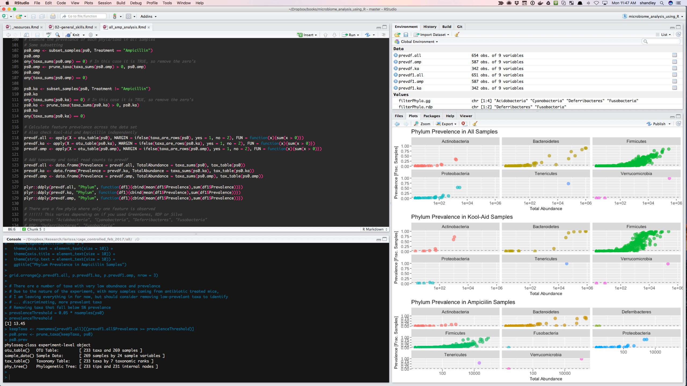

# General Skills

The completeion of any project in R, microbiome focused or not, will benefit from some basic knowledge of a few tools developed by the R community to help document and expedite your work. This book is not meant to be a replacement for the tremendous number of R tutorials and Workshops currently available (see references for a few recommendations). The reality is that to become profficient at using R will likely take you much longer than you expect. R is a fully developed software language, and like human language, takes many years of immersion to fully develop proficiency.

That being said, with some limited focus on learning, and with the aid of useful tools and an active support community, even a novice can complete a large number of basic analysis and should not shy away from working with R if their project would benefit from the packages, statistics or plotting made available through R.

Below are several brief introductions to working efficiently and effectively with R. The topics have been selected to target the microibome specific topics throughout this book, but are limited in scope. Links are provided for each topic if you wish to expand your knowledge further.

## Integrated Development Environment (IDE)

An [Integrated Development Environment](https://en.wikipedia.org/wiki/Integrated_development_environment) (IDE) is a term used by software developers to describe a comprehensive software toolbox for completing projects. Basiccally, it is single software package which pulls together all of the resources one needs to take a project from beginning to end. So imagine if Microsoft Office had a single software called the Microsoft IDE which combined Word, Excel and PowerPoint into a single software package. This would enable you to document, calculate and present your work all from one peice of software instead of working with them independently.

R has several IDE options. The material in this book will focuse on one, [RStudio](https://www.rstudio.com) which is continually supported, updated and tightly integrated with a number of useful R tools. However, there are other several other options listed below. Of note, you do not need an IDE to work with R. In fact, R can be run entirely from the command line which is useful for scripting workflows.

## List of popular R IDEs

* [RStudio](https://www.rstudio.com)
* [Microsoft Visual Studio](https://www.rstudio.com)
* [IntelliJ Plug In](https://plugins.jetbrains.com/plugin/6632-r-language-support)
* [Rattle](http://rattle.togaware.com)
* [StatET Plug In for Eclipse](http://www.walware.de/goto/statet)

The value of using an IDE for R can not be overstated. A well-developed IDE, such as RStudio will enable you to work seemlessly with your data, manage your packages and document and publish your work either as a static document or to a web-site.

