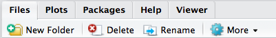

# General Skills

The completion of any project in R, microbiome focused or not, will benefit from some basic knowledge of a few tools developed by the R community to help document and expedite your work. This book is not meant to be a replacement for the tremendous number of R tutorials and Workshops currently available (see references for a few recommendations). The reality is that to become proficient at using R will likely take you much longer than you expect. R is a fully developed software language, and like human language, takes many years of immersion to fully develop proficiency.

That being said, with some limited focus on learning, and with the aid of useful tools and an active support community, even a novice can complete a large number of basic analysis and should not shy away from working with R if their project would benefit from the packages, statistics or plotting made available through R.

Below are several brief introductions to working efficiently and effectively with R. The topics have been selected to target the microbiome specific topics throughout this book, but are limited in scope. Links are provided for each topic if you wish to expand your knowledge further.

## Integrated Development Environment (IDE)

An [Integrated Development Environment](https://en.wikipedia.org/wiki/Integrated_development_environment) (IDE) is a term used by software developers to describe a comprehensive software toolbox for completing projects. An IDE it is single software package which pulls together all of the resources one needs to take a project from beginning to end. So imagine if Microsoft Office had a single software called the Microsoft IDE which combined Word, Excel and PowerPoint into a single software package. This would enable you to document, calculate and present your work all from one piece of software instead of working with them independently.

R has several IDE options. The material in this book will focus on one, [RStudio](https://www.rstudio.com) which is continually supported, updated and tightly integrated with a number of useful R tools. However, there are other several other options listed below. Of note, you do not need an IDE to work with R. In fact, R can be run entirely from the command line which is useful for scripting workflows.

## List of popular R IDEs

* [RStudio](https://www.rstudio.com)
* [Microsoft Visual Studio](https://www.rstudio.com)
* [IntelliJ Plug In](https://plugins.jetbrains.com/plugin/6632-r-language-support)
* [Rattle](http://rattle.togaware.com)
* [StatET Plug In for Eclipse](http://www.walware.de/goto/statet)

The value of using an IDE for R can not be overstated. A well-developed IDE, such as RStudio will enable you to work seamlessly with your data, manage your packages and document and publish your work either as a static document or to a web-site.

```{r Figure 1 RStudio}
knitr::include_graphics("./figures/ch02_rstudio_example.jpg")
```

RStudio is a popular IDE for several reasons. First, it can be run as a server from a cloud based or local server ([RStudio Server](https://www.rstudio.com/products/rstudio-server/)). This is useful if you want to have a number of people in a group work with a single installation or if you need the computing resources available in server/cloud hardware. Second, it provides a friendly front-end to access the R language. Being able to visualize code, files and plots in a single window is incredibly useful for exploring data. Third, it is tightly integrated with a number of useful tools such as [RMarkdown](http://rmarkdown.rstudio.com) for documenting your work or [Shiny](https://shiny.rstudio.com) for making interactive analysis documents and [many more useful tools](https://www.rstudio.com/products/rpackages/).

This book was written in RStudio using [Bookdown](https://github.com/rstudio/bookdown). All of the analysis and figures were completed within RStudio as well. You can reproduce all of the analysis using RMarkdown documents. All of this was made much simpler due to the tight integration of these packages within RStudio.

## Packages

The concept of *packages* has been brought up throughout this book already. Put simply, a package can be thought of as an app for analysis. Packages are developed by people from various research communities and deposited either into the official R package repository [CRAN](https://cran.r-project.org) or in curated, discipline specific repositories such as [Bioconductor](http://bioconductor.org). More recently a large number of packages are being hosted on [Github](http://github.com).

Between CRAN, Bioconductor and Github you should be pretty well-covered in package discovery and installation. There are slightly different ways to install packages from each resource:

* _CRAN_: There are two ways to install packages from CRAN in RStudio. The first way is from the *Packages* tab which you will see at the top of one of the panes in RStudio:

```{r Figure 1 RStudio Package Installation}

```

The other way is to use the *install.packages* command from the console. For example, the following code will install the *ade4* package.

```{r}
install.packages("ade4")
```

* _Bioconductor_: Installing packages from Bioconductor requires you to first install Bioconductor using the following commands:

```{r}
## try http:// if https:// URLs are not supported
source("https://bioconductor.org/biocLite.R")
biocLite()
```

Once bioconductor installs you can install specific libraries. The following command will install the *PhyloSeq* package which is used extensively in this book.

```{r}
## try http:// if https:// URLs are not supported
source("https://bioconductor.org/biocLite.R")
biocLite("phyloseq")
```

* _Github_: To install packages from Github you first have to install *Developer Tools*. The following series of commands would install Developer Tools and then install *ggplot2* from it's Github repository:

```{r}
install.packages("devtools")
devtools::install_github("tidyverse/ggplot2")
```

If everything goes smoothly the package will be installed and is ready to use. There can be some package specific issues such as the requirement for a dependency which you may need to read further documentation on at the package web site or by contacting the package author.

Once you have a package installed you need to load it using the *library* function in R. Again, this can be done two ways. The first is by checking the box next to the library in the package tab shown in Figure 2. The second is using the *library* command in the console.

```{r}
library(ggplot2)
package.version("ggplot2")
```

The above command will load the ggplot2 package into the current R session and is followed by a second command which will display the library version. Tracking library versions can be useful for reproducing and sharing code so it is a good habit to get into. Although it may seem tedious now, we will see how we can leverage RMarkdown documents to facilitate library loading and versioning.

## R Markdown

[RMarkdown](http://rmarkdown.rstudio.com) is a software package integrated into RStudio which facilitates documentation and reproducibility of your work. RMarkdown documents can be shared with colleageus or published on-line facilitating collaboration and open data sharing.

While there are some nuances to R Markdown documents there are three key principles you should understand before diving in. Once you understand the basics, you can extend your knowledge using the official [R Markdown](http://rmarkdown.rstudio.com/index.html) documentation.

* _Principle 1: Formatting_

[R Markdown](http://rmarkdown.rstudio.com/index.html) is based on the original [Markdown](http://daringfireball.net/projects/markdown/) tool which was designed to provide a simple syntax for writing documents for the web. This simple, code based format makes for an unobstructive writing environment. Formatting is done with mark-up codes instead of using functions in a word processor which makes it easy for other software such as web-browsers or [knitr](https://yihui.name/knitr/) (disussed below) to dissect and recompile into html or PDF documents. 

* _Principle 2: The chunk_

* _Principle 3: Publishing_


